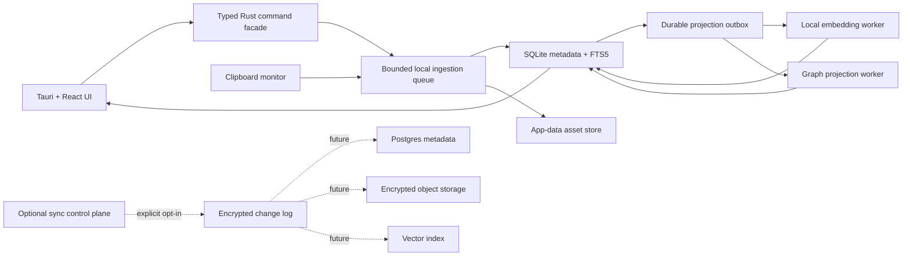

# CYMOS Architecture and Production Migration

## Executive Decision

CYMOS should remain a **modular, local-first desktop monolith** for the current release. The Tauri/Rust application is the security boundary, SQLite is the source of truth, and React is a local presentation layer.

Introducing FastAPI, Postgres, Qdrant, Neo4j, Redis, Kubernetes, or microservices before real multi-user or cross-device traffic exists would add credentials, network attack surface, deployment failures, and operational cost without improving clipboard capture. Those services become appropriate only for an optional sync and enterprise control plane.

## Current Risk Review

| Risk | Failure mode | Current hardening |
| --- | --- | --- |
| Repository-local data | Clipboard contents, exports, and backups can be accidentally committed or lost with a checkout. | Data now lives in the OS app-data directory. Legacy local data is migrated once; generated data paths are ignored by Git. |
| SQLite contention and interruption | Concurrent capture, delete, and automation work can produce `database is locked`, partial reads, or inconsistent backups. | WAL mode, foreign keys, connection limits, busy timeout, acquire timeout, process-level maintenance/graph locks, and `VACUUM INTO` backups. |
| Duplicate capture race | Check-then-insert logic produces duplicates under fast clipboard changes. | A unique content hash and `INSERT ... ON CONFLICT DO NOTHING` make capture idempotent; repeated copies update counters. |
| Ingestion overload | Image encoding or a slow local model blocks polling and causes missed copies or unbounded task growth. | Text/image size and pixel limits, a bounded ingestion semaphore, background image writes, and non-blocking capture polling. |
| Unsafe content | Oversized input, malformed image dimensions, invalid filters, and unexpected export values become memory, disk, or command-boundary failures. | Central Rust validation covers identifiers, filters, content sizes, colors, prompts, exports, and exact RGBA image payload size. |
| Stale frontend results | A slower search response can overwrite a newer query; typing triggers the full analytics dashboard. | Search responses are versioned in React, and memory-list refreshes are separated from heavier dashboard refreshes. |
| Misleading readiness claims | Displaying planned integrations, encryption, APIs, or sync as active creates a compliance and customer-trust failure. | Integration, plugin, API, encryption, and enterprise-control states now report planned, limited, or not configured until implemented. |
| Backup growth | A scheduled backup every cycle can consume all local disk. | Consistent SQLite snapshots are retained with a rolling 14-backup limit. |

## Important Remaining Limits

The local foundation is intentionally not an enterprise platform yet.

- Text search is `LIKE`-based and semantic ranking evaluates a bounded recent candidate set. Add SQLite FTS5 and cursor pagination before histories routinely reach tens of thousands of records.
- The graph is a derived projection. A failed or interrupted rebuild can leave it stale until the next rebuild. Move graph and semantic indexing to a durable outbox worker before treating them as strict transactional records.
- Local model adapters are best-effort. Any future network model must require explicit user consent, bounded requests, redacted logs, and a provider-specific data-processing policy.
- SQLite is the right source of truth for one local user. It is not a multi-device synchronization engine or a multi-tenant authorization store.
- Local audit entries are operational history, not tamper-evident security audit logs.

## Target Architecture



### Local Runtime Boundaries

1. **Capture boundary:** Clipboard data is untrusted and size-limited before analysis or disk writes.
2. **Command boundary:** Tauri commands validate every user-controlled field and return user-safe errors while retaining detailed local diagnostics.
3. **Storage boundary:** SQLite owns metadata; files belong only under the app-data asset root; deletion verifies ownership before removing an asset.
4. **Projection boundary:** Semantic and graph data are derived, rebuildable views. They must never be treated as the source of truth.
5. **Model boundary:** Prompts explicitly treat retrieved memory as untrusted reference material, never executable instructions.

### When Services Become Justified

Create a separate sync/control plane only after the product needs authenticated multi-device state or organization accounts. At that point, add:

- An append-only, encrypted change log with per-device keys and conflict resolution.
- Postgres for tenancy, devices, RBAC, retention policy, and audit metadata.
- Object storage for encrypted large assets.
- A vector service only after local FTS and bounded local ranking are no longer sufficient.
- A graph read model only when graph queries require cross-device scale beyond SQLite projections.
- A signed plugin protocol with capability-scoped permissions; never load arbitrary code in-process.

## Enterprise Edge Cases

- **Clipboard changes during AI analysis:** Persist the content captured at the time of the event, not whatever is currently on the clipboard when analysis completes.
- **Concurrent deletion and ingestion:** Keep graph/projection mutations serialized; introduce a durable deletion tombstone in the sync phase.
- **Image bombs and malformed buffers:** Validate width, height, byte count, checked multiplication, and a hard byte budget before decoding.
- **Legacy WAL data:** Close prior CYMOS releases before first upgraded launch. The migration copies the database and its `-wal`/`-shm` sidecars once.
- **Interrupted backup:** `VACUUM INTO` creates a transactionally consistent SQLite snapshot. Do not copy a live `.db` file directly when WAL is enabled.
- **Prompt injection in saved data:** Treat every stored note, webpage, and AI answer as data. Do not allow it to redefine system behavior or trigger actions.
- **Search races:** The UI discards results for superseded requests. Server-backed search will also need request IDs, cancellation, and pagination tokens.
- **Clock changes:** Use database-generated timestamps and monotonic sequence IDs for ordering; do not make sync conflict decisions from wall-clock time alone.
- **Retention and legal hold:** A future enterprise mode must retain deletion tombstones and enforce policy centrally. Local deletion is permanent by design today.

## Migration Plan

### Phase 0: Protect Existing Data

1. Close all running CYMOS instances.
2. Copy the existing `database/` folder to an encrypted external backup.
3. Launch the upgraded application once. It migrates the legacy database and assets into the OS app-data directory.
4. Verify a few memories and images, then verify a scheduled backup can be opened with SQLite.

### Phase 1: Harden the Local Vault

This release implements the first production baseline:

1. OS-owned app-data storage with legacy migration.
2. SQLite WAL, foreign keys, bounded pool, timeouts, indexes, and schema migration record.
3. Idempotent capture, payload validation, bounded ingestion, and retained backups.
4. A restrictive production Content Security Policy.
5. Honest platform capability states.

### Phase 2: Scale Local Retrieval

1. Add versioned SQL migrations through a dedicated migration runner.
2. Add FTS5 tables and triggers for content, summaries, keywords, and tags.
3. Replace the fixed candidate limit with cursor pagination and bounded ranking windows.
4. Add a `projection_outbox` table with retry state, backoff, and idempotency keys for graph and semantic jobs.
5. Add database integrity checks, restore drills, and crash-recovery tests.

### Phase 3: Secure Intelligence

1. Store model settings in a local keychain-backed configuration.
2. Make remote model access opt-in and show an egress disclosure before sending memory outside the device.
3. Add model request limits, cancellation, response schemas, content redaction, and prompt-injection evaluation tests.
4. Encrypt sensitive local assets using keys protected by the OS keychain.

### Phase 4: Optional Sync and Enterprise Mode

1. Define an encrypted, append-only sync protocol and device enrollment flow.
2. Deploy a control plane with tenant isolation, RBAC, OIDC/SAML, rate limits, and structured audit events.
3. Add Postgres and object storage first. Add a vector or graph service only when measured workload requires it.
4. Implement policy-driven retention, legal hold, export, deletion, and backup recovery.
5. Add signed desktop updates, SBOM generation, dependency scanning, security logging, and incident response runbooks.

## Release Gates

Do not label CYMOS enterprise-ready until all of the following are demonstrated:

- Restore a backup into a clean machine and verify captured text and image assets.
- Run load tests for rapid clipboard changes, image capture, and search while automation is active.
- Fuzz all Tauri command inputs and image metadata validation.
- Test upgrade and downgrade behavior across supported schema versions.
- Complete threat modeling for local storage, clipboard capture, model egress, plugin execution, and sync.
- Verify CSP, dependency audit, code signing, least-privilege permissions, and opt-in telemetry.
# Browser Companion

The optional Browser Companion uses a Manifest V3 producer-consumer flow that stays outside the desktop trust boundary until a user explicitly saves a guide:

```text
User enables current site
        |
        v
Content script pause detector
        |
        v
Sanitized cursor and DOM context
        |
        v
MV3 service worker rate limiter
        |
        +--> Local guide engine --> Browser side panel
        |
        +--> Optional transient screenshot --> Configured visual AI --> Browser side panel
        |
        v
Explicit "Save guide to CYMOS"
        |
        v
Local system clipboard --> CYMOS clipboard monitor --> SQLite vault
```

Before egress, CYMOS serializes the complete visual-AI request once and enforces a 3 MiB byte limit covering the image encoding, prompt text, and JSON structure. The prevalidated string is the only request body passed to `fetch`.

Three consecutive non-aborted remote visual-AI failures open an in-memory 60-second endpoint circuit breaker. The cooldown takes no screenshots or network actions, preserves local guidance, stores no error payload, and resets on success or AI-configuration change. An AI-configuration change also aborts every in-flight visual request before the new configuration is returned. A monotonic in-memory configuration epoch guards the pre-capture, post-capture, response, circuit-accounting, and queued persistence stages so an old endpoint/model response cannot become a new-configuration guide.

The current-site panel receives only the circuit's remaining cooldown duration and labels the status **Visual AI cooling down** while it is nonzero. A one-shot local timer refreshes the panel when retries become available; it does not persist circuit state or expose endpoint/error/request/response data.

Each remote visual request is bounded by a 12-second request-only timeout signal. The timeout aborts the fetch and streaming response read without marking the user-owned capture controller as cancelled, so a timed-out endpoint correctly contributes to the circuit breaker while navigation, consent, and configuration cancellation do not.

Before a screenshot, CYMOS atomically reserves one of 24 session-only visual-capture allowances for the current HTTP(S) origin in a rolling one-hour window. The budget uses serialized session-storage mutation so concurrent tabs cannot exceed it. It stores only origin/timestamp metadata, retains the 100 most recently used origins to bound session storage, is cleared with Browser Companion capture data or browser restart, and falls back locally once the allowance is exhausted.

The Browser Companion panel reads that same local budget record to show the active origin's remaining hourly allowance. Guide-update messages carry only the remaining count, maximum count, and, when exhausted, next-allowance timestamp so the display stays accurate without exposing screenshot, endpoint, request, or response data.

When an origin has exhausted its budget, the same metadata calculates the next available allowance from the oldest retained reservation. The panel renders that local timestamp; no timer, screenshot, endpoint, or page content is added to storage or the message.

The focused-control privacy gate also examines bounded HTML autocomplete metadata. Generic-looking inputs marked as password, one-time code, payment-card, WebAuthn, email, telephone, identity, organization, birth-date, or postal-address fields stay local and never invoke visible-tab capture. Before guide storage, clipboard handoff, or optional visual-AI egress, CYMOS canonicalizes this untrusted website attribute to recognized HTML tokens only; arbitrary section names and unknown values are discarded.

Before any screenshot, the same privacy gate rejects canonical page paths that identify common sensitive flows, such as sign-in, account, password, payment, checkout, billing, security, verification, and MFA. The matching is limited to complete path segments to avoid treating documentation paths such as `/guides/checkout-integration` as a sensitive transaction flow. Invalid URLs fail closed.

The extension requests no static website host access. It injects only after the user enables the active HTTP or HTTPS site with `activeTab` permission. The content script removes URL queries and fragments, redacts likely secrets, strips invisible control characters and bidirectional display overrides from text context, and sends bounded values. The service worker independently accepts context only with canonical HTTP(S) URLs, bounded field sizes, finite coordinates, valid timestamps, and opaque document identifiers, so malformed page-derived messages are rejected before any capture work. It rate-limits pause events and never persists screenshots. A separate in-memory 30-second same-target throttle suppresses repeated remote visual-image egress while continuing local guides; it stores no browser context and resets when the worker, tab, page, or consent state resets. Before capture, it suppresses visual work when the focused control signals a password, one-time code, token, payment, private key, or similar sensitive entry; this is a focused-control safeguard, not a claim that every other page region is secret-free. It also verifies CYMOS's exact managed endpoint record and Chrome's live optional-host permission immediately before a screenshot, so a permission removed outside CYMOS cannot result in a late visual capture. Since Chrome's visible-tab API captures by window rather than by explicit tab, CYMOS validates that the original tab remains active in the same window and still matches the sanitized page/document before and after capture; a failed post-capture check blocks remote image egress. Visual endpoint configuration is normalized in the panel and revalidated by the service worker: only HTTPS endpoints (or localhost development endpoints) without URL credentials, query parameters, or fragments are stored, model identifiers use a bounded safe character set, and session-only API keys are bounded non-whitespace values. The panel validates new endpoint, model, and key values before requesting optional-host access; the service worker repeats the checks before storage or egress. The remote visual-request builder independently repeats context sanitization at the network boundary, omits the internal document identifier, and allows only JPEG, PNG, or WebP data URLs within a 2 MiB raw-image budget. It presents the screenshot and all webpage-derived values to the model as untrusted reference data, so instructions embedded in a page must not alter the output contract or be followed. It sends no ambient credentials or referrer, bypasses HTTP caches, and rejects redirects so an endpoint cannot silently forward an image to another host. The response parser accepts only declared `application/json` responses and reads JSON through a 256 KiB streaming budget, rejecting oversized, empty, and malformed bodies without retaining them. Its OpenAI-compatible message content has a separate 16 KiB budget and must contain a bounded advisory schema: summary, confidence from 0 to 1, and one to five string steps. Schema failures remain local fallbacks rather than completed visual guides. A bounded session-only activity trail records local, completed visual, visual-fallback, or capture-unavailable outcomes without raw DOM excerpts, image bytes, API keys, endpoint URLs, request bodies, or AI response/error data. Its side panel reports the stored guide and event counts, allows current-page or all-capture-data clearing, and removes tab data automatically when the user navigates, closes a tab, or disables the active site. A per-tab capture epoch, latest-capture sequence, sanitized page-path check, opaque session-only document identifier, and abort controller prevent stale or superseded visual work from recreating context after navigation, consent revocation, a new pause, or a Manifest V3 worker wake-up. Visual-AI permission management tracks only the exact host-and-port patterns CYMOS requests, revokes stale patterns during endpoint rotation, and revokes all managed patterns when the user clears AI access. These mutations use serialized session writes, preventing a clear action from racing with a pause capture; a remote abort is best-effort and cannot retract data already accepted by a configured endpoint. Visual AI is optional, requires a permitted HTTPS endpoint (or localhost development endpoint), a confirmation before image sharing, and a session-only API key.

The MV3 manifest explicitly applies a restrictive CSP to extension pages and the service worker. Scripts and styles remain packaged-only, frames and form submission are disabled, and network connections are limited to HTTPS or local development hosts; Chrome's optional-host permission and CYMOS's exact endpoint checks still decide whether a configured endpoint can receive a request.
